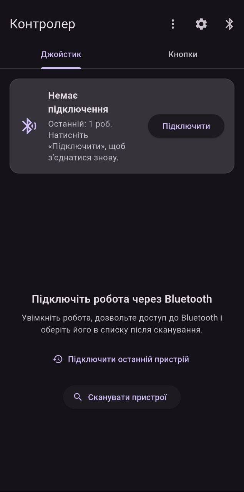
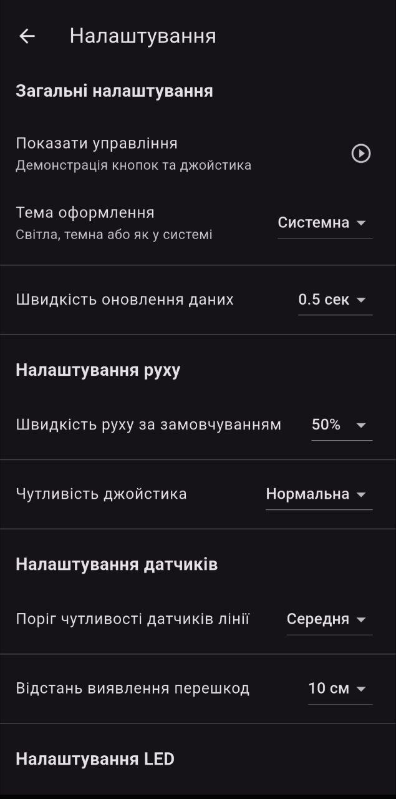
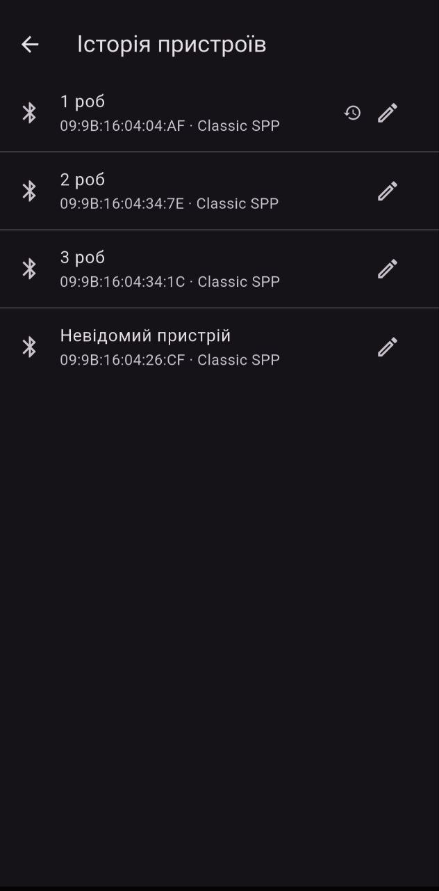

# RoboCtrl Flutter App
# Назва проєкту:RoboCtrl

> Мобільний застосунок для керування робомобілем на базі Raspberry Pi Pico з підтримкою Bluetooth LE та Bluetooth Classic.

-	## Загальна інформація
-	Тип проєкту: Мобільний застосунок (Android)
-	Мова програмування: Dart
-	Фреймворк: Flutter
-	Протоколи зв'язку: Bluetooth Classic (SPP) / Bluetooth Low Energy (BLE)
-	Апаратна платформа: Raspberry Pi Pico (RP2040) — робомобіль PicoGo / Waveshare ## Функціональні можливості
-	Сканування та підключення до Bluetooth-пристроїв (Classic SPP та BLE)
-	Керування рухом через віртуальний джойстик та кнопки
-	Керування адресною RGB LED-стрічкою (статичні кольори + анімації)
-	Відображення сенсорних даних у реальному часі (акумулятор, температура, датчик відстані, датчики лінії)
-	Телеметрія — графіки напруги, температури та відстані
-	Планувальник автономних маршрутів із записом телеметрії
-	Редактор маршрутів (послідовності кроків руху)
-	Автоматичне відновлення з'єднання при розриві
-	Система журналювання подій із збереженням у файл
-	Гнучке налаштування параметрів застосунку
-	Підтримка темної та світлої теми (Material 3) ## Структура проєкту
``` lib/
├── main.dart	# Точка входу, ініціалізація провайдерів

├── models/
│	├── robot_device.dart	# Модель пристрою (BLE / Classic)
│	├── sensor_reading.dart	# Показання сенсорів (JSON/CSV)
│	├── route.dart	# Маршрут (список кроків)
│	├── route_step.dart	# Крок маршруту (напрямок, швидкість, тривалість)
│	├── scheduled_task.dart	# Запланована задача (статус, телеметрія)
│	├── led_strip.dart	# Модель LED-стрічки (кольори, анімації)
│	└── line_sensor.dart	# Датчик лінії (калібрування, ПІД-позиція)
├── providers/
│	├── bluetooth_provider.dart	# Bluetooth-з'єднання, команди, телеметрія
│	├── settings_provider.dart	# Налаштування застосунку (SharedPreferences)
│	└── scheduler_provider.dart	# Планувальник автономних маршрутів
├── screens/
│	├── home_screen.dart	# Головний екран керування
│	├── dashboard_screen.dart	# Дашборд зі статистикою
│	├── sensors_realtime_screen.dart # Сенсори в реальному часі
│	├── telemetry_screen.dart	# Графіки телеметрії
│	├── scheduler_screen.dart	# Планувальник задач
│	├── route_editor_screen.dart	# Редактор маршрутів
│	├── task_details_screen.dart	# Деталі виконаної задачі
│	├── settings_screen.dart	# Налаштування
│	├── logs_screen.dart	# Журнал подій
│	├── devices_history_screen.dart # Історія підключень
│	└── control_guide_screen.dart	# Інструкція користувача
├── utils/
│	├── picogo_protocol.dart	# Протокол JSON-команд для мікроконтролера
│	├── logger.dart	# Система журналювання (5 рівнів)
│	└── bluetooth_error_dialog.dart # Діалог помилок Bluetooth
└── widgets/
└── direction_control.dart	# Кнопки керування напрямком ## Як запустити проєкт
### 1. Встановлення Flutter

-	Flutter SDK v3.x+ — [flutter.dev/docs/get-started/install](https://flutter.dev/docs/get-started/install)
-	Android Studio або VS Code з розширенням Flutter
-	Підключений Android-пристрій або емулятор (API 21+) ### 2. Клонування репозиторію
git clone https://github.com/Shef-Kryt/Dyplomna cd roboctrl

### 3. Встановлення залежностей

```bash
flutter pub get
```
### 4. Перевірка середовища

```bash flutter doctor```


### 5. Запуск на пристрої

```bash flutter run```
> Для роботи Bluetooth необхідний реальний Android-пристрій. На емуляторі Bluetooth недоступний.

### 6. Збірка APK

```bash
flutter build apk --release
```

Готовий файл: `build/app/outputs/flutter-apk/app-release.apk`
---
## Протокол взаємодії з мікроконтролером

Застосунок обмінюється даними з Raspberry Pi Pico через JSON-повідомлення. ### Команди руху
```json
{"Forward": "Down"}
{"Forward": "Up"}
{"Left": "Down"}
{"Right": "Up"}
```
### Команди швидкості

```json
{"Low": "Down"}
{"Medium": "Down"}
{"High": "Down"}
### Керування LED та зумером

```json
{"LED": "on"}
{"BZ": "off"}
{"RGB": "(255,0,128)"}
```

## Інструкція для користувача
1.	Запустіть застосунок — на головному екрані натисніть Сканувати пристрої
2.	Оберіть пристрій зі списку (рекомендовані відображаються першими)
3.	Керуйте рухом через джойстик або кнопки ← ↑ ↓ →
4.	Регулюйте швидкість — кнопки Low / Medium / High
5.	Перейдіть до розділів через нижню навігаційну панель:
-	Сенсори — показання датчиків у реальному часі
-	Телеметрія — графіки напруги та температури
-	Планувальник — маршрути та автономне виконання
-	Налаштування — параметри застосунку та теми ## Основні залежності
Пакет	Призначення
provider	Управління станом
flutter_blue_plus	Bluetooth Low Energy flutter_bluetooth_classic_serial Bluetooth Classic (SPP) shared_preferences	Збереження налаштувань
permission_handler	Системні дозволи
flutter_joystick	Віртуальний джойстик
fl_chart	Графіки телеметрії
path_provider	Робота з файлами
uuid	Генерація UUID


## Відомі проблеми та рішення

Проблема	Спосіб вирішення
Пристрій не видно під час сканування Увімкнути геолокацію
Не підключається Bluetooth Classic	Виконати спарювання в налаштуваннях ОС BLE не реагує на команди	Перевірити UUID характеристик
Помилка flutter pub get	Оновити Flutter до версії 3.x+ ## Використані джерела
-	[Flutter Documentation](https://docs.flutter.dev)
-	[flutter_blue_plus на pub.dev](https://pub.dev/packages/flutter_blue_plus)
-	[Bluetooth Core Specification 5.0](https://www.bluetooth.com/specifications/)
-	[Material Design 3](https://m3.material.io)
-	[Raspberry Pi Pico Documentation](https://www.raspberrypi.com/documentation/microcontrollers/)
-	[Provider — State Management](https://docs.flutter.dev/data-and-backend/state-mgmt/simple)
-	## Screenshots

 
